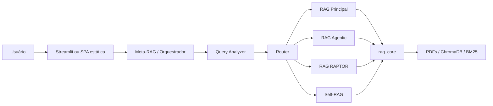

# Análise Técnica do Projeto RAG CCDEP

**Data da análise:** 20 de julho de 2026  
**Escopo:** arquitetura, backend, segurança, qualidade, avaliação, frontend e operação  
**Método:** diagnóstico inicial, implementação incremental nas fases 0–4 e regressão local

> **Atualização pós-implementação:** as seções de diagnóstico abaixo preservam o
> estado encontrado no início do trabalho. Os bloqueadores listados foram tratados
> nas fases subsequentes; o status consolidado está nesta seção e no `README.md`.

### Status após a evolução

- **Segurança:** removida a execução de código do LLM no fluxo produtivo; XSS,
  SSRF, autenticação interna, CORS/CSP e containers foram endurecidos.
- **Correção:** RAPTOR inicializa pela fábrica central; séries anuais, tipos,
  proveniência e invalidação de índices foram corrigidos.
- **Robustez:** deadline, orçamento, limites, falhas parciais, circuit breaker,
  health checks, failover e persistência atômica foram adicionados.
- **Arquitetura:** schemas, pipeline HTTP, manifestos, proveniência, runtime e
  interpreters duplicados foram consolidados em `rag_core`.
- **Qualidade:** CI, lint, type checking, testes, métricas Prometheus, benchmark,
  validação de citações/cálculos e avaliação reproduzível foram implementados.

Validação final local: **76 testes automatizados**, smoke do Streamlit, roteador e
pipeline aprovados; `ruff`, `mypy`, sintaxe JavaScript e `docker compose config`
aprovados. A build da imagem ficou coberta pela CI, pois o daemon Docker local não
estava disponível durante a validação.

## 1. Resumo executivo

O projeto é um **protótipo RAG avançado**, com uma arquitetura conceitualmente bem organizada:

- infraestrutura comum concentrada em `rag_core`;
- quatro estratégias de recuperação especializadas;
- um Meta-RAG que seleciona dinamicamente a estratégia;
- embeddings locais e persistência em ChromaDB;
- interfaces web e um pipeline inicial de avaliação.

Apesar dessa base positiva, o estado atual **não deve ser considerado pronto para produção ou exposição pública**. Foram identificados bloqueadores de segurança, falhas que impedem o funcionamento correto do RAPTOR e lacunas importantes de proveniência, validação e reprodutibilidade.

Os riscos mais urgentes são:

1. execução de código gerado por LLM sem isolamento efetivo;
2. RAPTOR incapaz de inicializar e com tipos incompatíveis nos níveis hierárquicos;
3. autenticação que não funciona de ponta a ponta no Meta-RAG;
4. possibilidade de XSS na SPA estática e SSRF no frontend Streamlit;
5. validação numérica que pode apresentar falsos positivos como dados “verificados”.

**Classificação de maturidade:** protótipo de pesquisa avançado, ainda sem os controles necessários para produção.

---

## 2. Visão geral da arquitetura

| Componente | Responsabilidade principal |
|---|---|
| `rag_core/` | Ingestão, processamento, ChromaDB, BM25, retrievers, LLM, segurança e validação |
| `rag_principal/` | Recuperação híbrida, tabelas, séries temporais e grafo opcional |
| `rag_agentic/` | Investigação iterativa com function calling e crítica da resposta |
| `rag_raptor/` | Índice com folhas e resumos em múltiplos níveis |
| `rag_selfrag/` | Recuperação, filtragem de relevância, geração e verificação de suporte |
| `rag_orchestrator/` | Análise da pergunta, roteamento e execução da engine selecionada |
| `meta_rag_ui/` | Interface Streamlit para Meta-RAG e engines diretas |
| `frontend/` | SPA estática legada, servida pelo RAG Principal e pelo Vercel |
| `evaluate.py` | Avaliação com RAGAS e teste de recusas adversariais |

### Pontos fortes da arquitetura

- Boa extração de infraestrutura comum para `rag_core`.
- Estratégias com responsabilidades conceitualmente distintas.
- Recuperação híbrida Vector + BM25, com reranking e fallback.
- Embeddings locais, reduzindo o envio de dados para serviços externos.
- Separação HTTP entre orquestrador e engines.
- Registry declarativo e roteador puro, facilitando testes unitários.
- Logging estruturado e suporte configurável a provedores de LLM.
- Skill especializada para consultas sobre mercado de trabalho.

---

## 3. Bloqueadores críticos

### 3.1 Execução de código gerado por LLM sem isolamento efetivo

O projeto executa Python gerado pelo LLM para extrair e calcular dados de tabelas e séries temporais. O mecanismo em [`rag_core/safe_exec.py`](rag_core/safe_exec.py#L55) bloqueia imports e atributos `dunder`, mas injeta o módulo pandas completo no namespace em [`tables_retriever.py`](rag_core/tables_retriever.py#L122) e [`timeseries_retriever.py`](rag_core/timeseries_retriever.py#L176).

Isso mantém acessíveis operações de:

- leitura de arquivos e URLs;
- escrita de arquivos;
- desserialização de pickle;
- acesso indireto a módulos internos usados pelo pandas;
- chamadas bloqueantes que o tracer por linha não consegue interromper.

Como o código é produzido a partir da pergunta e do conteúdo recuperado, ambos podem funcionar como vetores de prompt injection.

**Impacto:** leitura ou alteração de dados do host, acesso a segredos, execução arbitrária e indisponibilidade do processo.

**Recomendação imediata:** desativar esse caminho até que a execução ocorra em processo ou container descartável, sem rede, com filesystem somente leitura, usuário sem privilégios e limites rígidos de CPU, memória e tempo. A API exposta ao LLM deve ser uma lista pequena de operações analíticas permitidas, e não o pandas completo.

### 3.2 RAPTOR não inicializa

O startup do RAPTOR usa `OpenAI` sem importar o símbolo em [`rag_raptor/src/startup.py`](rag_raptor/src/startup.py#L153). O mesmo arquivo já importa `make_llm`, mas não o utiliza nesse ponto.

**Impacto:** `NameError` durante a inicialização, possivelmente depois do custo elevado de construção da árvore.

**Correção recomendada:** usar exclusivamente a fábrica central `make_llm`, respeitando provedor, modelo, URL e chave configurados.

### 3.3 Incompatibilidade de tipos nos níveis RAPTOR

As folhas recebem `raptor_level=0` como inteiro em [`raptor_indexing.py`](rag_raptor/src/raptor_indexing.py#L105), enquanto os resumos recebem o nível como string. A engine agrupa e ordena esses valores em [`raptor_engine.py`](rag_raptor/src/raptor_engine.py#L95).

Quando folhas e resumos aparecem juntos, `sorted()` pode lançar `TypeError`. A exceção é capturada e o contexto narrativo é descartado silenciosamente.

**Correção recomendada:** normalizar o nível para um único tipo no momento da escrita e da leitura e adicionar teste cobrindo recuperação mista de folhas e resumos.

### 3.4 Autenticação quebrada entre orquestrador e engines

As APIs exigem `x-api-key` quando `RAG_API_KEY` está definida, mas o cliente HTTP do orquestrador envia apenas JSON em [`rag_orchestrator/src/registry.py`](rag_orchestrator/src/registry.py#L171).

Assim, ativar a proteção faz as consultas orquestradas receberem `401`, posteriormente traduzido para `502`.

O endpoint [`POST /route`](rag_orchestrator/src/api.py#L90) também executa o analyzer LLM sem autenticação nem rate limiting.

**Correção recomendada:** separar a credencial pública da credencial interna, encaminhar o header de serviço para as engines e aplicar os mesmos controles em todos os endpoints com custo computacional.

### 3.5 XSS na SPA estática

A SPA processa respostas do LLM com `marked` e insere o resultado diretamente em `innerHTML` em [`frontend/app.js`](frontend/app.js#L202). As respostas também são persistidas em `localStorage` e renderizadas novamente.

**Impacto:** conteúdo induzido pela pergunta ou pelos documentos pode produzir HTML ativo e comprometer o navegador do usuário.

**Correção recomendada:** sanitizar todo Markdown convertido para HTML, adotar uma Content Security Policy restritiva e tratar qualquer saída do LLM como conteúdo não confiável.

### 3.6 SSRF no frontend Streamlit

O Streamlit permite que o usuário informe qualquer URL de backend em [`meta_rag_ui/components/sidebar.py`](meta_rag_ui/components/sidebar.py#L38). A requisição é feita pelo servidor Streamlit, não pelo navegador.

Se a interface for pública, isso pode permitir sondagem de serviços internos acessíveis pelo container.

**Correção recomendada:** remover a URL arbitrária em produção ou aplicar uma allowlist rigorosa de hosts, portas e esquemas.

---

## 4. Integridade, proveniência e qualidade das respostas

### 4.1 Metadados de fonte não chegam de forma confiável ao prompt

Os prompts exigem citações com arquivo e página, mas a síntese usa `get_content()` sem serializar explicitamente os metadados em [`rag_principal/src/analysis_engine.py`](rag_principal/src/analysis_engine.py#L81).

Problemas decorrentes:

- o modelo pode não receber arquivo e página;
- chunks tabulares adicionam apenas o arquivo, sem página;
- a API devolve apenas `file` e `score`;
- não há trecho, página, ID do chunk ou vínculo entre afirmação e evidência.

**Recomendação:** criar um serializador de evidência compartilhado, com arquivo, página, tipo, ID, score e conteúdo. A mesma estrutura deve alimentar o prompt, a API e a interface.

### 4.2 Validação numérica pode gerar falsos positivos

O validador em [`rag_core/numerical_validator.py`](rag_core/numerical_validator.py#L38) procura números lexicalmente e remove o símbolo `%` durante a normalização.

Foi confirmado em verificação local que uma resposta contendo `42%` é considerada verificada contra uma fonte contendo apenas `42 pessoas`.

Outras limitações:

- não compara unidade, indicador, período ou entidade;
- pode localizar o número em um trecho irrelevante;
- cálculos derivados corretos tendem a ser marcados como não verificados;
- resumos sintéticos do RAPTOR podem ser tratados como fonte original;
- a resposta é entregue mesmo quando há números não verificados.

O QualityGate ainda retorna razão `1.0` para respostas sem números em [`quality_gate.py`](rag_orchestrator/src/quality_gate.py#L18).

**Conclusão:** a telemetria atual significa “número semelhante encontrado em algum chunk”, e não “afirmação comprovada”.

### 4.3 Índices podem permanecer obsoletos

O snapshot das engines percorre somente arquivos do primeiro nível e verifica apenas arquivos ainda existentes. A ingestão, porém, usa busca recursiva em [`rag_core/ingestion.py`](rag_core/ingestion.py#L168).

Consequências:

- arquivo removido pode continuar recuperável;
- mudanças em subdiretórios podem não disparar reindexação;
- alteração do modelo de embedding, chunking ou schema não invalida o índice;
- o manifest baseado em `mtime` não garante integridade do conteúdo.

**Recomendação:** usar manifest versionado com hash de conteúdo, versão do pipeline, modelo de embedding, parâmetros de chunking e comparação simétrica entre estado atual e anterior.

### 4.4 Séries anuais são classificadas incorretamente

`anual` não aparece entre as granularidades temporais e uma coluna numérica de anos é rejeitada como eixo temporal em [`timeseries_retriever.py`](rag_core/timeseries_retriever.py#L43).

Isso pode encaminhar séries anuais para o retriever de tabelas estáticas ou fazê-las voltar ao contexto narrativo.

### 4.5 Limitações específicas do RAPTOR

- A sumarização considera somente os primeiros 20 trechos de cada cluster.
- Não há linhagem explícita entre resumo e nós filhos.
- `source_file` é escolhido de forma arbitrária entre várias fontes.
- Resumos gerados por LLM podem ser usados posteriormente como evidência e como base da validação numérica.
- Em níveis superiores, a proveniência acumulada é progressivamente perdida.

---

## 5. Engines e comportamento operacional

### 5.1 RAG Principal

- O interpreter e a síntese fazem chamadas síncronas dentro de um endpoint assíncrono.
- Uma falha em qualquer retriever pode abortar todo o `asyncio.gather`.
- O prompt exige citações que o contexto não garante fornecer.
- O grafo é opcional e fica desligado por padrão.

### 5.2 RAG Agentic

- Sempre faz prefetch das três fontes antes da decisão agentic.
- Pode executar até oito iterações de 60 segundos, além da crítica.
- Não há deadline global nem orçamento explícito de tokens ou custo.
- O histórico de ferramentas cresce sem controle de contexto.
- O crítico é fail-open: erro ou JSON inválido aprova a entrega.

### 5.3 Self-RAG

- Uma resposta correta do ISREL com lista vazia restaura todos os trechos.
- Falha da verificação de suporte equivale a suporte total.
- Após retry, a nova resposta é aceita mesmo que continue sem suporte.
- A verificação observa apenas uma fração truncada do contexto e da resposta.

### 5.4 Meta-RAG

- Não há failover no modo single-best.
- A disponibilidade informada por `/health` não influencia o roteamento.
- O modo chamado de “fusion” apenas escolhe uma resposta; não funde evidências.
- A pontuação recompensa quantidade de fontes, inclusive duplicadas.
- O timeout HTTP de 180 segundos pode ser menor que o pior caso das engines.
- Após timeout do cliente, o backend pode continuar consumindo LLM e CPU.

---

## 6. Inconsistências do roteamento e configuração

### 6.1 Grafo anunciado, mas desativado

O perfil do Principal anuncia “híbrido + grafo” em [`registry.py`](rag_orchestrator/src/registry.py#L57), mas:

- `RAG_USE_GRAPH` é falso por padrão;
- o Compose não habilita a variável;
- `--graph` só é repassado no modo CLI e é ignorado no modo servidor.

Consultas relacionais podem, portanto, ser roteadas com base em uma capacidade que não está ativa.

### 6.2 Schema do analyzer e router divergentes

O analyzer não inclui `comparativo` entre os valores declarados de `query_type`, mas o perfil RAPTOR e os testes dependem desse valor.

### 6.3 `.env` carregado tarde em execução local

URLs, modelo padrão, CORS e parte do logging são avaliados durante o import, antes do `load_dotenv()` do lifespan. Configurações presentes apenas no `.env` local podem ser ignoradas. No Docker, onde as variáveis entram antes do processo, o problema é menor.

O analyzer ainda captura qualquer exceção sem registrar a causa e cai silenciosamente para o fallback heurístico.

---

## 7. Frontend, Docker e deploy

### 7.1 Duas interfaces concorrentes

O projeto mantém:

1. Streamlit em `:8501`, integrado ao Meta-RAG e às engines diretas;
2. SPA estática em `/app`, integrada somente às quatro engines.

Isso já produziu diferenças de autenticação, recursos, identidade visual, documentação e deploy.

**Recomendação:** escolher uma interface canônica. A opção mais alinhada à arquitetura atual é o Streamlit consumindo o Meta-RAG.

### 7.2 Deploy Vercel incompleto

O [`vercel.json`](vercel.json#L3) publica apenas a SPA estática. Ela constrói endpoints usando as portas `8000–8003` no domínio atual, sem proxy ou backend correspondente. Em HTTPS, uma API HTTP externa também seria bloqueada por mixed content.

### 7.3 Docker pouco endurecido

- Todas as APIs e interfaces são publicadas no host.
- CORS está configurado como `*` no Compose.
- A autenticação é opt-in e não está habilitada na configuração local inspecionada.
- A imagem executa como root.
- Não há healthchecks, limites de recursos ou condição de prontidão.
- O frontend herda o `.env` e recebe credenciais de LLM desnecessariamente.
- Dependências de compilação e avaliação permanecem na imagem final.
- `.streamlit/config.toml` não é copiado para a imagem.

### 7.4 Contexto de build desnecessariamente grande

Backups do Chroma e arquivos ZIP na raiz não são excluídos pelo `.dockerignore`. No workspace analisado, isso acrescenta aproximadamente **359 MB** ao contexto de build.

### 7.5 Probes excessivos no Streamlit

Cada rerun consulta o backend escolhido e percorre os cinco serviços conhecidos de forma sequencial. Com timeouts de cinco segundos, uma tela em ambiente offline pode levar perto de 30 segundos para renderizar.

---

## 8. Testes e avaliação

### Verificações realizadas

| Verificação | Resultado |
|---|---|
| Parsing AST de 76 arquivos Python | Sem erros de sintaxe |
| Script de testes do roteador | Todos os checks passaram |
| Smoke do pipeline do orquestrador | Todos os checks passaram |
| `docker compose config --quiet` | Configuração válida |
| Testes `pytest` | Não executados: `pytest` ausente no ambiente |
| Smoke Streamlit | Não executado: `streamlit` ausente no ambiente atual |
| Engines end-to-end | Não executadas nesta análise |

`pytest` não aparece nas dependências do projeto. Os testes do orquestrador são scripts com `main()`, não casos coletáveis normalmente pelo pytest.

### Resultados locais existentes

Os artefatos locais mais recentes encontrados são anteriores às mudanças atuais:

| Split | Data | Faithfulness | Context precision | Context recall | Recusa |
|---|---:|---:|---:|---:|---:|
| Dev | 04/05/2026 | 0,744 | 0,843 | 0,733 | — |
| Test | 08/04/2026 | 0,801 | 0,953 | 1,000 | — |
| Adversarial | 08/04/2026 | — | — | — | 1,000 |

Esses resultados são promissores para um protótipo, mas não validam o worktree atual.

### Lacunas de avaliação

- Os splits usados por `evaluate.py` ficam em `data/`, pasta ignorada pelo Git.
- O dataset versionado em `evaluation/` não é o arquivo consumido pelo script.
- Uma clonagem limpa não reproduz a avaliação.
- Não há thresholds que façam o processo falhar em regressões.
- Não há CI, lint, type checking ou teste de build da imagem.
- O roteamento do Meta-RAG não é avaliado contra rótulos esperados.
- Não há métricas de latência, custo, correção de citações ou precisão numérica semântica.

---

## 9. Manutenibilidade e estado do repositório

### Duplicação

APIs, startups, manifests e CLIs são muito semelhantes entre as engines. A divergência do RAPTOR que deixou `OpenAI` indefinido é um exemplo concreto do custo dessa duplicação.

Agentic, RAPTOR e Self-RAG também repetem listas de palavras-chave em vez de usar o detector compartilhado de mercado de trabalho.

### Empacotamento frágil

Todos os módulos internos se chamam genericamente `src` e alteram `sys.path`. O isolamento por processo evita parte do conflito, mas dificulta testes conjuntos, empacotamento e reutilização como bibliotecas.

### Contrato HTTP não compartilhado

As engines devolvem contratos semelhantes, mas não existe um schema compartilhado e versionado. Isso aumenta o risco de divergência entre backend, orquestrador e frontend.

### Worktree no momento da análise

- branch dois commits à frente do remoto;
- 16 arquivos rastreados modificados;
- arquivos essenciais ainda não rastreados, incluindo `rag_core/answer_style.py` e componentes da nova UI;
- ZIP duplicado não rastreado;
- mudanças de UI dependem de arquivos novos ainda fora do Git.

Um commit ou deploy parcial pode ficar incompleto.

---

## 10. Plano de correção recomendado

### Fase 0 — Contenção imediata

- [ ] Restringir portas a `127.0.0.1` até corrigir os bloqueadores.
- [ ] Desativar ou isolar completamente o código pandas gerado pelo LLM.
- [ ] Sanitizar Markdown/HTML da SPA e adicionar CSP.
- [ ] Remover ou restringir URL arbitrária no Streamlit.
- [ ] Proteger `/query` e `/route` e implementar credencial interna entre serviços.
- [ ] Impedir que o frontend receba chaves de LLM.

### Fase 1 — Restaurar funcionamento e integridade

- [ ] Corrigir a inicialização do RAPTOR usando `make_llm`.
- [ ] Normalizar `raptor_level` e testar recuperação mista.
- [ ] Serializar metadados de fonte no contexto.
- [ ] Ampliar `SourceInfo` com página, trecho e ID.
- [ ] Substituir o validador lexical por validação contextual de indicador, unidade e período.
- [ ] Corrigir detecção de remoções, subdiretórios e versão do pipeline de indexação.
- [ ] Corrigir o tratamento de séries anuais.

### Fase 2 — Resiliência e custo

- [ ] Adicionar deadline global, limites de iteração e orçamento de tokens.
- [ ] Implementar failover e circuit breaker no orquestrador.
- [ ] Fazer o health check influenciar o roteamento.
- [ ] Executar chamadas síncronas fora do event loop.
- [ ] Tratar falhas parciais dos retrievers sem perder toda a resposta.
- [ ] Definir semântica real para fusion ou renomear o comportamento atual.

### Fase 3 — Consolidação

- [ ] Extrair startup, manifest e schemas de API compartilhados.
- [ ] Substituir pacotes genéricos `src` por namespaces próprios.
- [ ] Escolher uma UI canônica.
- [ ] Atualizar `DOCKER.md` e criar um README principal.
- [ ] Criar imagem multi-stage, usuário não-root e healthchecks.
- [ ] Corrigir `.dockerignore` e separar dependências de produção e desenvolvimento.

### Fase 4 — Qualidade contínua

- [ ] Versionar datasets reproduzíveis ou fornecer script de download com hashes.
- [ ] Adicionar CI com pytest, lint, type checking e build do Compose.
- [ ] Transformar métricas em gates com thresholds.
- [ ] Avaliar o roteamento do Meta-RAG separadamente.
- [ ] Medir precisão de citação, exatidão numérica, latência e custo.
- [ ] Executar uma nova avaliação depois das correções e registrar o baseline.

---

## 11. Conclusão

O projeto apresenta uma direção arquitetural forte e um conjunto interessante de estratégias RAG. A separação entre infraestrutura comum, engines especializadas e Meta-RAG é adequada para pesquisa e experimentação.

O principal desafio agora não é adicionar novas estratégias, mas **consolidar segurança, proveniência e confiabilidade operacional**. Corrigidos os bloqueadores e estabelecidos testes reproduzíveis, a base pode evoluir de protótipo avançado para uma aplicação implantável e auditável.

> O diagnóstico original orientou uma evolução incremental. O sistema está
> substancialmente mais seguro e auditável, mas ainda requer uma rodada RAGAS com
> credenciais/dados reais e validação da imagem em um daemon Docker antes de uma
> promoção formal para produção.
